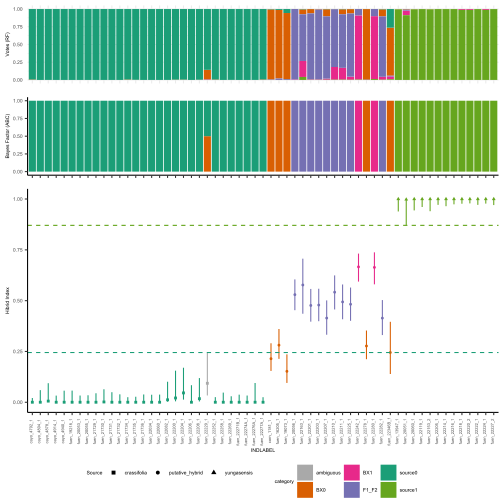

# Hy-MLC: A Hybrid Identification Workflow using Machine Learning and ABC

**Hy-MLC** is a novel bioinformatics workflow for identifying hybrid generations (e.g., F1, F2, Backcross) from genome-wide SNP data. It overcomes limitations of traditional methods like NewHybrids by combining a Bayesian hybrid index with Machine Learning (Random Forest) and Approximate Bayesian Computation (ABC) to handle thousands of loci efficiently.

> **Reference:** If you use Hy-MLC in your research, please cite: Aguirre-Mazzi (unpublished)

## Overview

Traditional tools for hybrid classification struggle with large SNP datasets. Hy-MLC addresses this with a four-step process:
1.  **Simulation** of hybrid genotypes from pure parental samples.
2.  **Hybrid Index** calculation for all individuals.
3.  **Feature Selection** using a Random Forest classifier to identify the most informative summary statistics.
4.  **Final Classification** using an Approximate Bayesian Computation (ABC) model for probabilistic assignment.

This workflow is implemented in R.

## Prerequisites

Before you begin, ensure you have the following R packages installed:

```r
# Install core required packages
install.packages(c("adegenet", "gghybrid", "randomForest", "abc"))
# for loading data (optional)
install.packages("dartR") 
#different pipelines can be used but the basic imput for our functions is genlight object 
# for plotting (if using our plotting function)
install.packages(c("ggplot2", "ggpubr")) 
```

## Usage
Follow the scripts and see comments for instructions and considerations

### Script 1: Data Preparation, Simulation and Hybrid index analysis
Prepare your genotype data for the two parental species (S0 and S1). The data can be a vcf file

File: scripts/1_Hybrid_index_analysis.R


### Script 2: Random Forest and ABC based inference of hybrid genea
File: scripts\2_RF_and_ABC_classification.R

### Script 3: Modified version to work with more than one pair of species
In some cases when multiple related species pairs are being analyzed it is reasonable to concatenate simulated datasets and train RF and ABC models with pooled data. This improves classification (hybrid generation inference) with more robust models.

File: scripts\2_RF_and_ABC_classification_multi.R

## Example result



 Classification of parentals (W. crassifolia and W. yungasensis) and their putative hybrids.
 First row: Hybrid category classification votes from Random Forest.
 Second row: Hybrid category posterior probabilities (Bayes factors) from Approximate Bayesian Computation (ABC). 
 Bottom row: Bayesian hybrid index estimates. Points show posterior medians, with lines indicating 95% highest density intervals (HDI). Dashed lines represent boundaries for source0 and source1, specimens falling between these lines are 'test' subjects in hybrid index analysis. Shapes represent a priori knowledge, and colors denote ABC-derived hybrid categories including non admixed individuals in points, and hybrid assigment probability in barplots